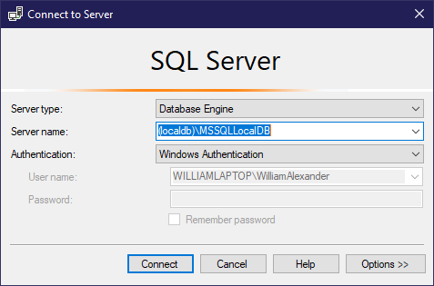

# FloridaCounties
Getting Florida counties maps in to SQL Server Database.

## Description
A solution containing two projects: FloridaCounties is a simple C# console application targetting .NET Core 3.1 and a XUnit Test project with little value. 
The console project uses EntityFrameworkCore with NetTopologySuite to populate a table containing mainly the name of each county with its geographic limits in the form of a polygon.

## Instructions:
1. Clone the project in Visual Studio.
2. Restore the Nuget packages packages and build the project.
3. Verifiy that the solution starting project is FloridaCounties.
4. Open Tools > Nuget Package Manager > Package Manager Console and run Update-Database. 
    - *(This will create the database in your (localdb)\MSSQLLocalDB instance, verify it by opening View > SQL Server Object Explorer)*
5. Run the project. 
    - *(This will query the portal for the data, clear the content of the table tblCounties and populat it with the data retrieved)*

### Notes
You can query the newly created database using SQL Server Management Studio by connecting the localdb instance.


Now we are allowed to write SQL scripts like the following that returns the name of the county for a give location.

```TSQL
USE FloridaCounties;
GO

DECLARE @MyLocation geography = geography::STPointFromText('POINT(-84.247332 30.48548)', 4326);

SELECT C.Id
	, C.[Name]
FROM dbo.tblCounties AS C
WHERE C.Shape.STContains(@MyLocation) = 1;
```
